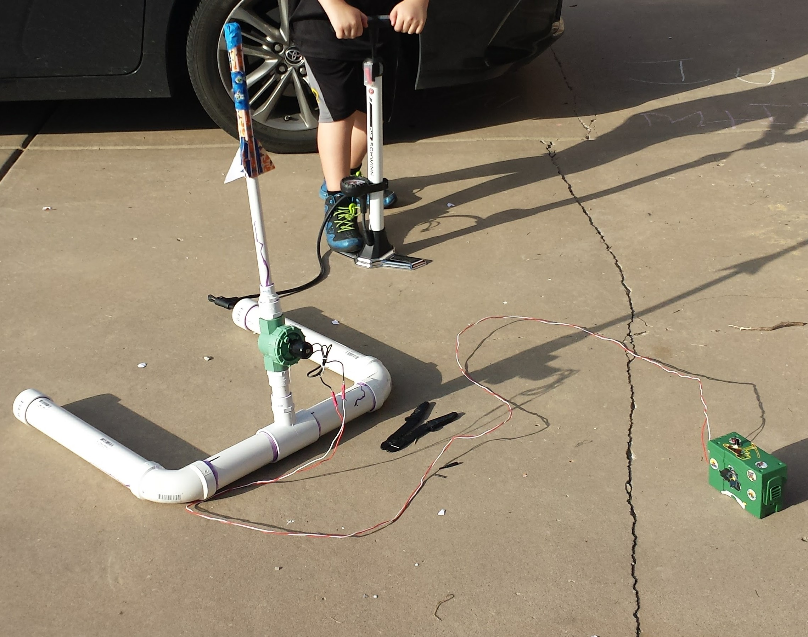

# RocketBlaster

## _Air powered rocket launcher_

### Current Requirements:

- Supplied with 18V-24V, likely with two 9V batteries
- Main toggle switch for controlling power to the system (lights red LED when closed)
- Secondary toggle switch will act as a safety switch (lights yellow LED when closed)
- A momentary switch will be used for triggering the launch (lights green LED during launch sequence)
- When the launch sequence is triggered, the microcontroller triggers playback of an audio file from the DFPlayer Mini (DFR0299) module
- After a time that correlates to the end of the audio playback, triggers a MOSFET to switch the 18V-24V source for the solenoid valve
